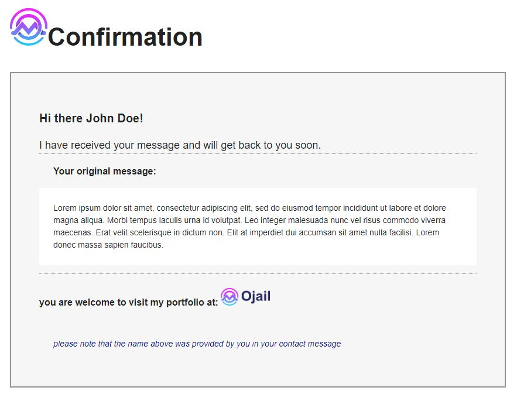

# e-mail server
a simple e-mail server that handles incoming messages to a contact form.

#### Project intent:
Taking messages from users and sending reception-confirmation.

#### Techs used:
- Node.js
- Javascript
- Handlebars
- Express

### Summary:
Created the server app using **Express** which handles the HTTP requests:
currently the server responds to two HTTP requests; a post and a get request as these are the ones I needed for the contact form.
for more information about how to use them visit instruction page [Here](https://oj-contact-server.herokuapp.com/ "Here")
POST request takes a json object with this form:
```json
{
  "name": "The name to send",
  "email": "the e-mail to send",
  "message": "the message to send"
}
```

#### Proposed POST function for frontend application:
```typescript
async function sendMail(name:string, email:string, message:string) {
    const response = await fetch('https://oj-contact-server.herokuapp.com/api/contact', {
        method: 'POST',
        credentials: 'same-origin',
        headers: {
            'Content-Type': 'application/json'
        },
        body: JSON.stringify({name, email, message})
    });
}
```

#### Generated html messages:
Both the incoming and the confirmation messages are generated by **Hanndlebars** and **CSS**.

Confirmation message preview:


#### To test this:
You can visit my portfolio [ojail.online](https://ojail.online/ "ojail.online")